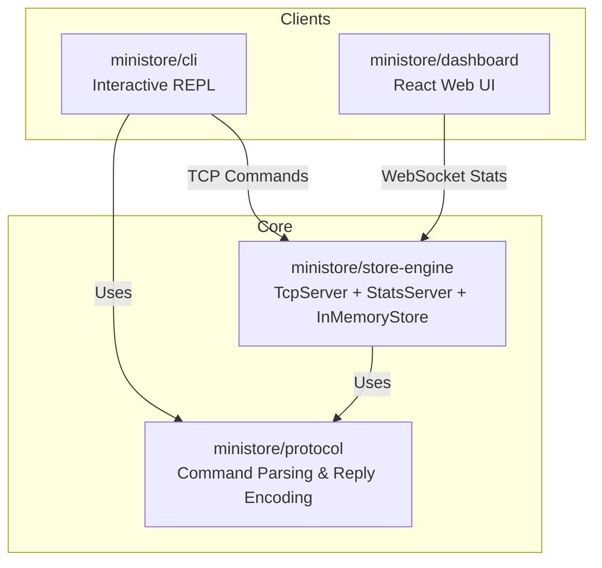

# MiniStore

[](https://github.com/nainatyagi040-svg/MiniStore/actions/workflows/ci.yml)

MiniStore is an in-memory key-value store inspired by Redis. Built from the ground up in Node.js/TypeScript, it features a custom TCP protocol with RESP-like encoding, TTL tracking with LRU eviction, and durable persistence via background snapshots and an Append-Only File (AOF). To provide a complete ecosystem, the monorepo includes the core `store-engine` database, a shared `protocol` library, a React-based live `dashboard` (powered by WebSocket stats), and an interactive REPL `cli` client.

## Benchmarks

MiniStore includes a raw throughput benchmark tool to measure performance for basic operations. Note that actual performance varies wildly based on your hardware, network, and node environment. The tool spins up a client and pipelines operations against a locally running server.

### Running the Benchmark

First, start the MiniStore server:
```bash
npm start
```

In another terminal, run the benchmark suite:
```bash
npm run benchmark
```

You can optionally configure the number of operations (default is 50,000):
```bash
npm run benchmark -- --ops 100000
```

### Example Output
*(Note: These numbers depend heavily on the environment)*

```
--- Benchmark Results ---
┌─────────┬──────────────────┬───────────┬─────────────────┬────────────┐
│ (index) │ Command          │ Total Ops │ Total Time (ms) │ Ops/sec    │
├─────────┼──────────────────┼───────────┼─────────────────┼────────────┤
│ 0       │ 'SET'            │ 50000     │ '1882.18'       │ '26,565'   │
│ 1       │ 'GET'            │ 50000     │ '410.04'        │ '1,21,940' │
│ 2       │ 'LPUSH/LPOP'     │ 50000     │ '664.20'        │ '75,278'   │
│ 3       │ 'HSET/HGET'      │ 50000     │ '3367.15'       │ '14,849'   │
│ 4       │ 'Mixed Workload' │ 50000     │ '1211.56'       │ '41,269'   │
└─────────┴──────────────────┴───────────┴─────────────────┴────────────┘
```

## Architecture Overview

The monorepo is divided into four cleanly separated packages:



- **`@ministore/protocol`**: Shared library for zero-copy parsing of the custom wire format and serializing replies.
- **`@ministore/store-engine`**: The heart of the database. Runs the TCP command server, the `InMemoryStore` data structure, background persistence (RDB + AOF), and a WebSocket server for exposing internal metrics.
- **`@ministore/cli`**: A lightweight REPL client that connects over TCP to send commands and parse responses.
- **`dashboard`**: A live UI for visualizing key space, memory usage, hit rates, and other runtime metrics.

## Command Reference

The `store-engine` currently supports the following commands, executed directly against the `InMemoryStore`:

| Command | Description |
|---------|-------------|
| **`SET key value [EX seconds]`** | Set a string key to a value, optionally with a Time-To-Live (TTL). |
| **`GET key`** | Get the value of a string key. |
| **`DEL key`** | Delete a key (any type). |
| **`EXPIRE key seconds`** | Set a timeout on an existing key. |
| **`EXISTS key`** | Check if a key exists in the store. |
| **`TTL key`** | Get the remaining TTL of a key (-1 if persistent, -2 if missing). |
| **`PERSIST key`** | Remove the existing timeout on a key. |
| **`KEYS pattern`** | Find all keys matching the given regular expression pattern. |
| **`LPUSH key value [value ...]`** | Prepend one or multiple values to a list. |
| **`LPOP key`** | Remove and get the first element in a list. |
| **`RPUSH key value [value ...]`** | Append one or multiple values to a list. |
| **`RPOP key`** | Remove and get the last element in a list. |
| **`LRANGE key start stop`** | Get a range of elements from a list. |
| **`LLEN key`** | Get the length of a list. |
| **`HSET key field value [field value ...]`** | Set the string value of a hash field. |
| **`HGET key field`** | Get the value of a hash field. |
| **`HDEL key field [field ...]`** | Delete one or more hash fields. |
| **`HGETALL key`** | Get all the fields and values in a hash. |
| **`HLEN key`** | Get the number of fields in a hash. |
| **`BGSAVE`** | Asynchronously save the dataset to disk (Snapshot). |
| **`BGREWRITEAOF`** | Asynchronously rewrite the append-only file (Compact AOF). |
| **`SUBSCRIBE channel [channel...]`** | Listen for messages published to the given channels. |
| **`UNSUBSCRIBE [channel...]`** | Stop listening for messages posted to the given channels. |
| **`PUBLISH channel message`** | Post a message to a channel. |
| **`MULTI`** | Start a transaction block. |
| **`EXEC`** | Execute all commands issued after MULTI. |
| **`DISCARD`** | Discard all commands issued after MULTI. |

## Persistence

MiniStore ensures durability using a dual persistence model:

1. **Snapshotting (`dump.json`)**: Periodically dumps the entire in-memory dataset to disk. Configurable via `MINISTORE_SAVE_INTERVAL_MS`.
2. **Append-Only File (`appendonly.aof`)**: Logs every mutating command (`SET`, `RPUSH`, etc.) as it happens. Configurable via `MINISTORE_AOF_FSYNC`:
   - `"everysec"` (default): Groups AOF writes and `fsync`s to disk once per second in the background. A great balance between performance and safety (at most 1 second of data loss).
   - `"always"`: Synchronously `fsync`s after *every* mutating command. Highly durable but incurs significant I/O overhead.
   - `"no"`: Relies on the operating system to flush the output buffers.

On startup, MiniStore loads the snapshot first (if present) and then replays the AOF line-by-line to recover the exact pre-crash state.

## Setup & Run Instructions

From the root of the repository, install dependencies and build the packages:

```bash
# 1. Install dependencies
npm install

# 2. Build the monorepo packages
npm run build
```

To run the database and the dashboard concurrently:

```bash
npm run start:all
```

To connect to the database via the interactive CLI:

```bash
npm run cli
```

## Running with Docker

You can run the entire MiniStore stack (database and dashboard) using Docker Compose.

```bash
# Start the stack in the background
docker compose up -d
```

- The **Live Dashboard** will be accessible at `http://localhost:3000`.
- The **Store Engine TCP Server** will be accessible at `localhost:6380`.
- Persistence files (dump and AOF) are stored in a persistent Docker volume, so your data will survive container restarts.

## Deploying to Railway

If you deploy `store-engine` and `dashboard` as separate Web Services/Static Sites on Railway, note that Railway's default HTTP proxy handles HTTP/WebSocket traffic but **does not proxy raw TCP traffic** over the standard web port.

Because of this limitation:
- The Live Dashboard (WebSocket) will connect perfectly and work live.
- The `npm run cli` interactive client (raw TCP) will **not** be able to connect to the Railway deployment unless you specifically configure a Railway TCP Proxy. It works flawlessly out-of-the-box when pointing at a locally running `store-engine` or Docker container.

> **Note on Persistence**: Railway's default filesystem is ephemeral. This means persistence (dump/AOF files) will only survive within a single running instance. When the app sleeps or redeploys, data will be reset. For durable persistence across restarts, either attach a Railway Volume or use Docker locally!

## Running Tests

To run the full test suite across the monorepo packages:

```bash
npm run test --workspaces
```

## Features & Limitations

**Implemented Features:**
- [x] O(1) String and Hash operations.
- [x] Native List data structure with head/tail operations.
- [x] Active and Lazy TTL expiration.
- [x] Strict Max-Keys limit with Least-Recently-Used (LRU) eviction.
- [x] RDB-style snapshots and AOF durability with background compaction.
- [x] Pub/Sub messaging system (`SUBSCRIBE` / `PUBLISH`).
- [x] Custom zero-dependency wire protocol.
- [x] Live WebSocket telemetry for monitoring.
- [x] Transactions (`MULTI`, `EXEC`, `DISCARD`) for atomic execution.

**Known Limitations:**
- No Authentication/ACLs (currently meant for trusted local networks).
- No Clustering or Replication support.
- Limited commands (e.g. no `ZSET` or `Set` primitives yet).
